<div dir="rtl">

# مهاجرت اپلیکیشن میکروسرویس به Kubernetes

مهاجرت اپلیکیشن Docker Compose موجود در پوشه `last project/` به کلاستر محلی Kind با نام `devops-cluster`، در namespace برابر `user-system`.

---

## معماری سیستم — چه کسی به چه کسی وصل می‌شه

</div>

```
اینترنت / هاست
      │  localhost:30000  (Kind port mapping: 30000 → hostPort 30000)
      ▼
Service "nginx"      (NodePort 30000 → 80)
      │  reverse proxy، upstream: backend:8000
      ▼
Service "backend"    (ClusterIP، پورت 8000)
      │  DB_HOST=postgres، اتصال از طریق psycopg2
      ▼
Service "postgres"   (Headless / clusterIP: None، پورت 5432)
      │
      ▼
StatefulSet "postgres"  (ذخیره‌سازی روی PVC)
```

<div dir="rtl">

- فقط `nginx` از بیرون کلاستر قابل دسترسه (NodePort). سرویس‌های `backend` و `postgres` از نوع ClusterIP هستن و از خارج کلاستر دیده نمی‌شن.
- بک‌اند از طریق DNS داخلی Kubernetes به نام `postgres` به دیتابیس وصل می‌شه (مقدار `DB_HOST` که در Compose برابر `db` بود، در اینجا `postgres` شده).
- Nginx از طریق نام سرویس `backend` ترافیک رو به بک‌اند هدایت می‌کنه.
- اعتبارنامه‌های دیتابیس (`POSTGRES_USER`، `POSTGRES_PASSWORD`، `POSTGRES_DB`) داخل یک Secret به نام `postgres-secret` نگه‌داری می‌شن و هم StatefulSet و هم Deployment بک‌اند از اون استفاده می‌کنن.

---

## ساختار فایل‌ها

</div>

```
k8s/
├── db/
│   ├── secret.yaml          ← اعتبارنامه‌های دیتابیس
│   ├── service.yaml         ← سرویس Headless برای postgres
│   └── statefulset.yaml     ← دیتابیس PostgreSQL با PVC
├── backend/
│   ├── configmap.yaml       ← تنظیمات غیرحساس (DB_HOST و ...)
│   ├── deployment.yaml      ← اپ FastAPI با ۲ replica
│   ├── service.yaml         ← سرویس ClusterIP
│   ├── hpa.yaml             ← HorizontalPodAutoscaler
│   └── pdb.yaml             ← PodDisruptionBudget
├── nginx/
│   ├── configmap.yaml       ← فایل nginx.conf
│   ├── deployment.yaml      ← پراکسی معکوس Nginx
│   └── service.yaml         ← سرویس NodePort روی پورت 30000
├── app/
│   ├── Dockerfile
│   ├── main.py
│   └── requirements.txt
├── screenshots/             ← اسکرین‌شات‌های تأیید اجرا
├── deploy.sh                ← اسکریپت کامل build → load → apply
└── README.md
```

<div dir="rtl">

---

## مرحله‌به‌مرحله پیاده‌سازی

### مرحله ۰ — آماده‌سازی ایمیج بک‌اند برای Kind

Kind به ایمیج‌های محلی Docker دسترسی مستقیم نداره. ایمیج باید ساخته بشه و داخل نود کلاستر لود بشه، وگرنه خطای `ImagePullBackOff` می‌گیریم.

</div>

```bash
cd k8s
docker build -t backend:local ./app
kind load docker-image backend:local --name devops-cluster
```

<div dir="rtl">

در Deployment از `image: backend:local` با `imagePullPolicy: IfNotPresent` استفاده شده.

---

### مرحله ۱ — دیتابیس (`k8s/db/`)

- **`secret.yaml`** — یک Secret با نام `postgres-secret` شامل مقادیر `admin`، `mysecretpassword` و `project_db` (همان مقادیر فایل `.env` پروژه قبلی). همچنین namespace `user-system` رو به‌صورت idempotent می‌سازه.
- **`service.yaml`** — سرویس Headless با `clusterIP: None` و نام `postgres`، تا StatefulSet یک DNS پایدار داشته باشه.
- **`statefulset.yaml`** — یک replica با ایمیج `postgres:15-alpine` و `volumeClaimTemplates` برای PVC اختصاصی.

**⚠️ نکته مهم:** متغیر `PGDATA` روی `/var/lib/postgresql/data/pgdata` (یک **زیرپوشه**) تنظیم شده. بدون این تنظیم، Postgres با خطای `directory not empty` بالا نمی‌آد، چون ریشه PVC فولدر `lost+found` دارد.

**بررسی سلامت:** هر دو probe با دستور `pg_isready -U $POSTGRES_USER -d $POSTGRES_DB` پیاده شدن.

**منابع:** درخواست: 100m CPU / 128Mi حافظه — حداکثر: 500m CPU / 512Mi حافظه

---

### مرحله ۲ — بک‌اند (`k8s/backend/`)

- **`configmap.yaml`** — مقادیر غیرحساس: `DB_HOST=postgres` و `BACKEND_PORT=8000`.
- **`deployment.yaml`** — ۲ replica، به همراه یک `initContainer` که قبل از شروع اپ، با `pg_isready -h postgres` منتظر می‌مونه تا دیتابیس آماده بشه (معادل Kubernetes برای `depends_on: service_healthy` در Compose). بررسی سلامت روی مسیر `/health` پیکربندی شده. همچنین `podAntiAffinity` از نوع `preferred` اضافه شده تا replicaها ترجیحاً روی نودهای مختلف پخش بشن.
- **`service.yaml`** — سرویس ClusterIP با نام `backend` روی پورت 8000.
- **`hpa.yaml`** — مقیاس‌بندی خودکار بین ۲ تا ۵ replica بر اساس ۷۰٪ CPU (نیاز به metrics-server دارد — بخش مشکلات رو ببینید).
- **`pdb.yaml`** — PodDisruptionBudget با `minAvailable: 1`.

---

### مرحله ۳ — Nginx (`k8s/nginx/`)

- **`configmap.yaml`** — فایل `nginx.conf` که از پروژه قبلی برای Kubernetes تطبیق داده شده؛ مقدار `proxy_pass` از `http://web:8000` به `http://backend:8000` تغییر کرده. یک مسیر مستقل `/health` هم برای بررسی سلامت خود nginx اضافه شده.
- **`deployment.yaml`** — ConfigMap رو از طریق `subPath` روی `/etc/nginx/nginx.conf` سوار می‌کنه.
- **`service.yaml`** — NodePort روی پورت `30000`، منطبق با port mapping کلاستر Kind.

---

### مرحله ۴ — قابلیت اطمینان

سه مکانیزم پیاده شده:

| مکانیزم | فایل | توضیح |
|:---|:---|:---|
| **HPA** (اصلی) | `backend/hpa.yaml` | مقیاس‌بندی خودکار ۲ تا ۵ replica بر اساس ۷۰٪ CPU |
| **PDB** (اضافی) | `backend/pdb.yaml` | همیشه حداقل ۱ replica در دسترس باشه |
| **Anti-Affinity** (اضافی) | `backend/deployment.yaml` | replicaها ترجیحاً روی نودهای مختلف پخش بشن |

برای HPA، ابزار `metrics-server` روی کلاستر نصب شد و با فلگ `--kubelet-insecure-tls` پیکربندی شد (برای سازگاری با گواهی‌نامه‌های self-signed در Kind).

---

## تأیید اجرا — اسکرین‌شات‌ها

### نود کلاستر و اطلاعات کنترل پلین

</div>

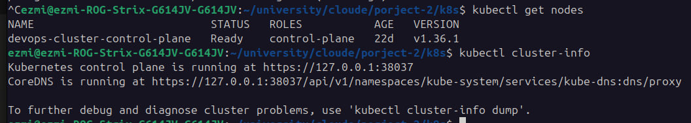

<div dir="rtl">

---

### Namespace ساخته‌شده (`user-system`)

</div>

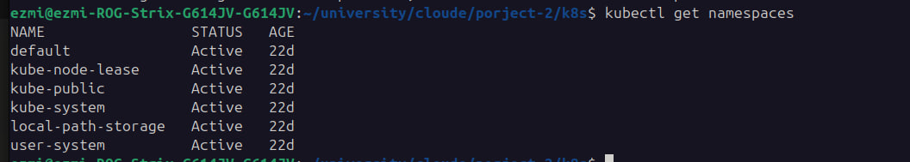

<div dir="rtl">

---

### تمام پادها در حال اجرا — وضعیت `1/1 Running`

</div>

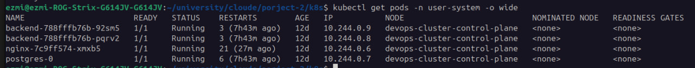

<div dir="rtl">

---

### نمای کامل تمام منابع namespace

</div>

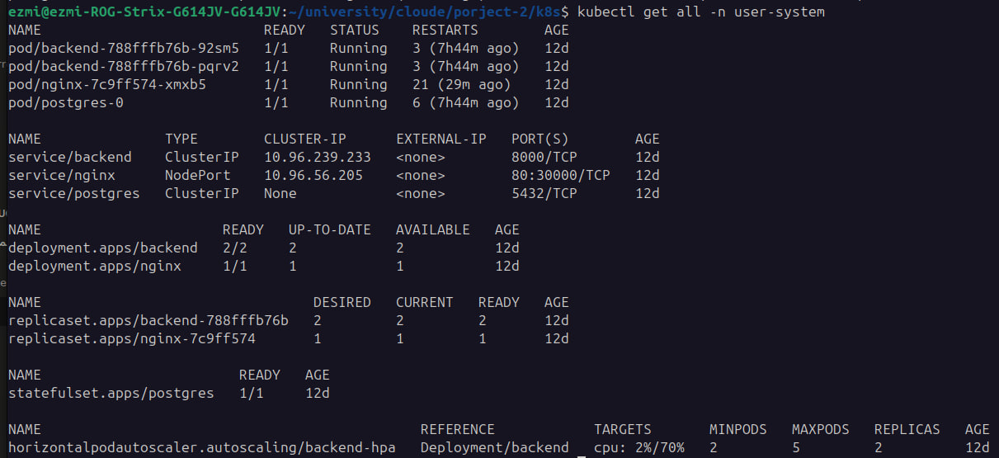

<div dir="rtl">

---

### Secret و ConfigMap ها

</div>

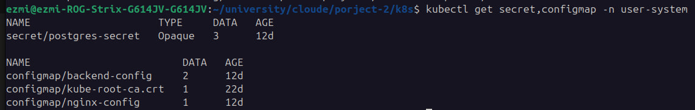

<div dir="rtl">

---

### PVC بایند‌شده و تأیید اتصال به دیتابیس

</div>

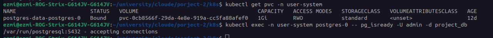

<div dir="rtl">

---

### تست سرویس بک‌اند از داخل کلاستر (بدون ایمیج خارجی)

</div>

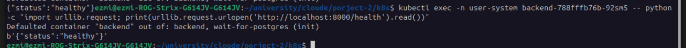

<div dir="rtl">

---

### تست کامل API از بیرون — از طریق Nginx (NodePort 30000)

</div>

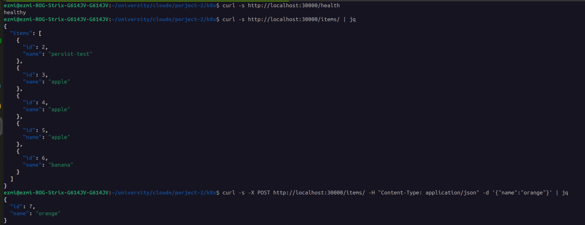

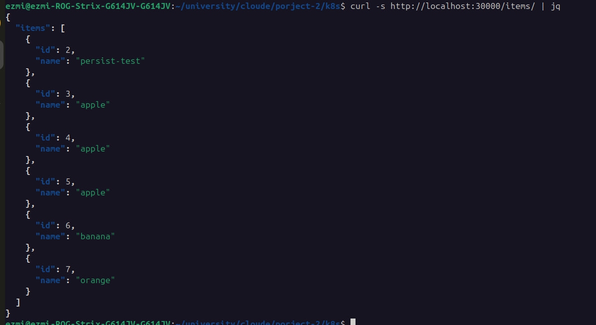

<div dir="rtl">

---

### وضعیت HPA و PDB

</div>

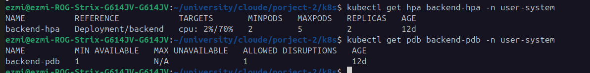

<div dir="rtl">

---

### لاگ‌های InitContainer — انتظار برای آماده شدن دیتابیس

</div>

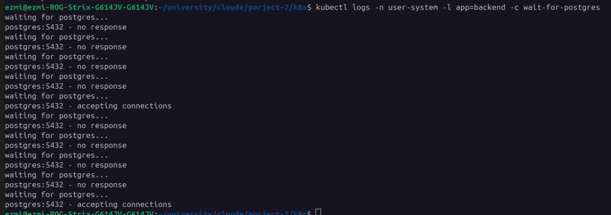

<div dir="rtl">

---

### تست ماندگاری داده — حذف پاد postgres و بازیابی خودکار

</div>

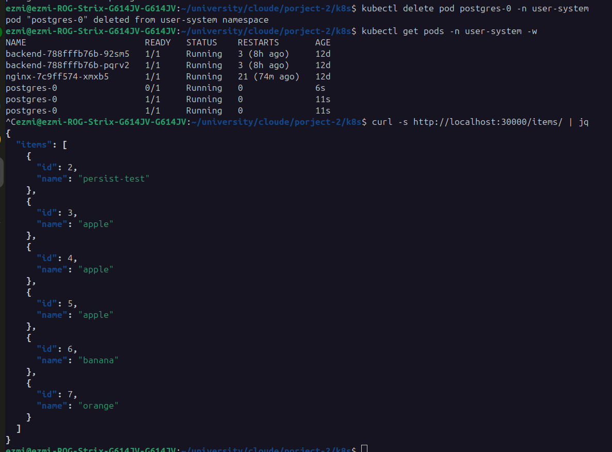

<div dir="rtl">

---

## مشکلات برخورد شده و راه‌حل‌ها

همه مشکلات زیر مربوط به **محیط پیش‌موجود کلاستر** بودن، نه مانیفست‌ها.

---

### ۱. خطای دانلود ایمیج روی پادهای تستی موقت

**مشکل:** در حین تست، تلاش برای بالا آوردن یک پاد موقت با ایمیج عمومی `curlimages/curl` جهت بررسی سرویس بک‌اند از داخل کلاستر، با خطای `ImagePullBackOff` مواجه شد. دلیل این بود که این ایمیج روی نود Kind موجود نبود و پراکسی محلی (`127.0.0.1:10808`) هم در آن لحظه از داخل نود در دسترس نبود.

**راه‌حل:** به‌جای دانلود ایمیج جدید، از دستور `kubectl exec` روی یکی از پادهای `backend` که از قبل در حال اجرا بود استفاده شد. بدین ترتیب تأیید شد که `GET /health` از داخل کلاستر مقدار `{"status":"healthy"}` برمی‌گردونه.

</div>

```bash
kubectl exec -n user-system backend-788fffb76b-92sm5 -c backend -- \
  curl -s http://backend:8000/health
```

<div dir="rtl">

---

### ۲. خطای دانلود ایمیج‌های عمومی (postgres و nginx)

**مشکل:** نود Kind یک متغیر محیطی `HTTP_PROXY=http://127.0.0.1:10808` داشت که فقط در فضای شبکه هاست معتبره، نه داخل container نود. در نتیجه هر درخواست pull از Docker Hub با خطا مواجه می‌شد.

**راه‌حل:** ایمیج‌ها روی هاست (که پراکسی درست داره) دانلود شدن و سپس مستقیماً داخل containerd نود وارد شدن:

</div>

```bash
docker pull postgres:15-alpine
docker save postgres:15-alpine | docker exec -i devops-cluster-control-plane \
  ctr --namespace=k8s.io images import -
```

<div dir="rtl">

دستور `kind load docker-image` برای این ایمیج‌ها به‌دلیل ساختار multi-platform manifest list کار نکرد و به روش `ctr import` برگشتیم.

---

### ۳. گیر کردن `local-path-provisioner` — PVC بایند نمی‌شد

**مشکل:** پاد `local-path-provisioner` در وضعیت `CreateContainerError` گیر کرده بود (تداخل اسم container در containerd) و در نتیجه PVC پستگرس هرگز بایند نمی‌شد و پاد `postgres-0` در وضعیت `Pending` می‌موند.

**راه‌حل:** حذف پاد تا Deployment آن‌ را با اسم تازه بازسازی کنه:

</div>

```bash
kubectl delete pod -n local-path-storage -l app=local-path-provisioner --force
```

<div dir="rtl">

---

### ۴. کرش کنترل پلین به‌دلیل اختلاف ساعت — DNS کلاستر از کار افتاد

**مشکل:** API server با خطای `service account token is not valid yet` کرش می‌کرد. این باعث شد همه کلاینت‌های داخل کلاستر (CoreDNS، kube-proxy و ...) با خطای `Unauthorized` مواجه بشن. در نتیجه DNS داخلی از کار افتاد و Nginx با خطای `host not found in upstream "backend"` در حلقه کرش می‌زد.

**علت احتمالی:** نود Kind بیش از ۹ روز قبل راه‌اندازی شده بود و احتمالاً در این مدت به‌دلیل sleep یا suspend شدن سیستم، ساعت داخلیش drift پیدا کرده بود.

**راه‌حل:** ری‌استارت container نود Kind **بدون** حذف یا بازسازی کلاستر (داده‌های etcd روی دیسک حفظ شدن):

</div>

```bash
docker restart devops-cluster-control-plane
```

<div dir="rtl">

---

## دستورات Build → Load → Apply

> **سریع‌ترین راه:** فقط اسکریپت `./deploy.sh` رو اجرا کن — همه مراحل زیر رو به‌صورت idempotent انجام می‌ده.

</div>

```bash
cd k8s

# ۰. ساخت و لود ایمیج بک‌اند
docker build -t backend:local ./app
kind load docker-image backend:local --name devops-cluster

# ایمیج‌های عمومی (در صورت نبود دسترسی مستقیم به رجیستری)
docker pull postgres:15-alpine
docker save postgres:15-alpine | docker exec -i devops-cluster-control-plane \
  ctr --namespace=k8s.io images import -
docker pull nginx:alpine
docker save nginx:alpine | docker exec -i devops-cluster-control-plane \
  ctr --namespace=k8s.io images import -

# ۱. دیتابیس
kubectl apply -f db/secret.yaml
kubectl apply -f db/service.yaml
kubectl apply -f db/statefulset.yaml

# ۲. بک‌اند
kubectl apply -f backend/configmap.yaml
kubectl apply -f backend/deployment.yaml
kubectl apply -f backend/service.yaml
kubectl apply -f backend/hpa.yaml
kubectl apply -f backend/pdb.yaml

# نصب metrics-server (اگر روی کلاستر نیست)
kubectl apply -f https://github.com/kubernetes-sigs/metrics-server/releases/latest/download/components.yaml
kubectl patch deployment metrics-server -n kube-system --type='json' \
  -p='[{"op":"add","path":"/spec/template/spec/containers/0/args/-","value":"--kubelet-insecure-tls"}]'

# ۳. Nginx
kubectl apply -f nginx/configmap.yaml
kubectl apply -f nginx/deployment.yaml
kubectl apply -f nginx/service.yaml
```

<div dir="rtl">

پایش وضعیت پادها:

</div>

```bash
kubectl get pods -n user-system -w
```

<div dir="rtl">

---

## نحوه تست هر سرویس

همه چیز از طریق Nginx (تنها نقطه ورود خارجی) قابل دسترسه:

</div>

```bash
# تست سلامت
curl http://localhost:30000/health
curl http://localhost:30000/

# عملیات CRUD
curl -X POST http://localhost:30000/items/ \
  -H "Content-Type: application/json" -d '{"name":"apple"}'

curl http://localhost:30000/items/
curl "http://localhost:30000/items/search?name=app"
curl -X DELETE http://localhost:30000/items/1

# تست از داخل کلاستر (از طریق exec روی پاد بک‌اند)
kubectl exec -n user-system deploy/backend -c backend -- \
  curl -s http://backend:8000/health

# وضعیت دیتابیس
kubectl exec -n user-system postgres-0 -- pg_isready -U admin -d project_db

# وضعیت HPA و PDB
kubectl get hpa backend-hpa -n user-system
kubectl get pdb backend-pdb -n user-system
```

<div dir="rtl">

---

## فرضیات

- مقادیر `POSTGRES_USER=admin`، `POSTGRES_PASSWORD=mysecretpassword` و `POSTGRES_DB=project_db` مستقیماً از فایل `last project/.env` گرفته شدن.
- سورس اپ (`main.py`، `requirements.txt`، `Dockerfile`) به پوشه `k8s/app/` کپی شده تا پوشه `k8s/` به‌تنهایی self-contained و قابل build باشه.
- حجم PVC برای postgres (`1Gi`) برای این اپ demo کافیه.
- Anti-Affinity از نوع `preferred` تعریف شده نه `required`، چون کلاستر Kind تک‌نود داره — اگر `required` بود، replica دوم هرگز schedule نمی‌شد.
- مسیر `/health` در Nginx یک پاسخ استاتیک برمی‌گردونه (پروکسی به بک‌اند نیست) تا بررسی سلامت خود Nginx مستقل از وضعیت بک‌اند عمل کنه.

---

## کارهای آینده (پیاده نشده)

- **Redis + NetworkPolicy (مرحله ۵):** اضافه کردن Redis برای caching و تعریف NetworkPolicy برای محدود کردن دسترسی‌ها: فقط Nginx بتونه به بک‌اند روی پورت 8000 وصل بشه، فقط بک‌اند بتونه به postgres روی 5432 و redis روی 6379 وصل بشه.

- **Ingress + تنظیمات امنیتی (مرحله ۶):** جایگزین کردن NodePort با یک Ingress resource (نیاز به نصب ingress-nginx controller روی Kind) با TLS و هدرهای امنیتی.

- **Prometheus + Grafana با Helm (مرحله ۷):**

</div>

```bash
helm install kube-prom-stack prometheus-community/kube-prometheus-stack \
  --namespace monitoring --create-namespace
```

<div dir="rtl">

بعد از نصب، یک ServiceMonitor برای بک‌اند تعریف می‌شه وقتی که endpoint مربوط به `/metrics` فعال بشه.

</div>
